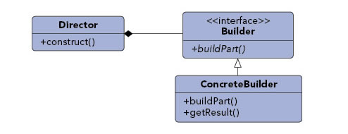

### 建造者模式（Builder Pattern）

##### 创建模式（Creational Pattern）

#### 定义

***Allows for the dynamic creation of objects based upon easily interchangeable algorithms.***

***使用多个简单的对象一步一步构建成一个复杂的对象。建造者模式，就是把复杂，易出错的进行封装。便于创建对象。将创建和展现分开***

将一个复杂的构建与表示分离，使得同样的材料，因为有了不同的构建过程，会有不一样的构建结果（不一样的表示）。



在建造者模式中

```go

ConcreteBuilder builder = new ConcreteBuilder();
Director director = new Director( builder );//将元素传给构建器

director.construct(); //具体的构建方法
Product product = builder.getResult();//显示结果
```


### 优点

### 例子分析

##### 一. 汽车案例


### 参考文档：

https://www.jianshu.com/p/a200c63adf2e