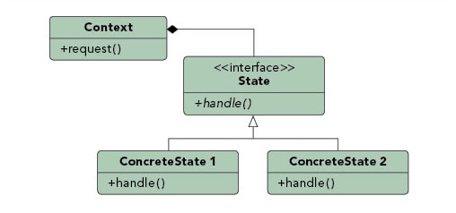

### 状态模式（State Pattern）

##### 行为模式（Behavioural Pattern）

#### 定义

***Ties object circumstances to its behavior, allowing the object to behave in different ways based upon its internal state.***

***。***

### 优点

### 例子分析

##### 电梯案例

### 参考文档：