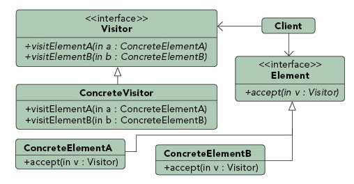

### 访问者模式（Visitor Pattern）

##### 行为模式（Behavioural Pattern）

#### 定义

***Represent an operation to be performed on elements of an object structure. Visitor lets you define a new operation without changing the classes of the elements on which it operates.***

***访问者模式用于操作某个结构中各个对象. 它可以不用改变对象本身, 对对象的新操作定义在访问者自己内部.***

### 优点

### 例子分析

##### 一. 汽车案例

##### 二. 购物车案例

### 参考文档：
