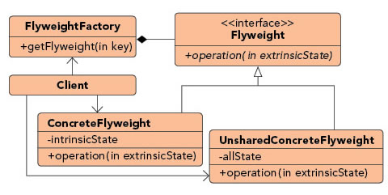

### 享元模式（Fly Weight Pattern）

##### 结构模式（Structural Pattern）

#### 定义

***Facilitates the reuse of many fine grained objects, making the utilization of large numbers of objects more efficient.***

*** ***



享元模式中提出了两个重要的概念，内部状态intrinsic和外部状态extrinsic。

内部状态是可以被共享的，外部状态是不可以被共享的，外部状态的数据应该是被传入的。

上面两句话可能有些拗口，很多时候享元模式都会以在线游戏来举例。游戏中一些角色是一样的，比如其外形、贴图等，这就是其内部状态，在内存中，可以只需要一份，这就实现了数据的共享；而这种游戏角色会在地图上出现多次，只是出现的位置、血量、其他数值会有差异，这就是外部状态，需要在内存中维护多份来体现差异。

### 优点
1. 尽可能实现对象复用，降低内存开销。
2. 因为对象复用，也减低了重新创建对象的性能开销。

### 例子分析

##### 邮件模版案例
1. 某电子商务系统会发送消息提醒给客户以告知信息，不同类型的消息套用不同的模版，模版的数量有多种，下面列举几种以举例。

模版1
```go
感谢你的支持, 你购买的商品<<ProductName>>, 订单号<<OrderNo>>,已经发货, 快递单号为<<TrackNo>>
```

模版2
```go
客户你好, 你关注的商品<<ProductName>>, 正在促销打折! 数量不多!
```

模版3
```go
客户你好, 我们已经你对订单<<OrderNo>>的评价, 感谢!
```

2. 当需要给客户发送信息时候，只需要调用正确的模版然后套用相关数据发送信息即可。

3. 代码示例

message 结构体是不可共享的外部状态，是消息的变化的内容。
```go
type Message struct {
	ProductName string
	OrderNo     string
	TrackNo     string
	TemplateNo  int
}

func (m *Message) Merge(MessageTemplate string) string {
	message := strings.ReplaceAll(MessageTemplate, "<<ProductName>>", m.ProductName)
	message = strings.ReplaceAll(message, "<<OrderNo>>", m.OrderNo)
	message = strings.ReplaceAll(message, "<<TrackNo>>", m.TrackNo)
	return message
}
```

全局变量F充当缓存作用，缓存所有可以共享的内部状态，也就是消息的模板，当缓存中没有模板存在的时候，就调用QueryByNo函数去数据库查，这里也可以看到，缓存模板也减少了请求数据的开销，这正是享元模式的意义所在。
```go
var F = make(map[int]*string)

func GetMsgTemplate(templateNo int) string {
	msgTemplateBody := F[templateNo]
	if msgTemplateBody == nil {
		//模拟去数据库查询
		messageBody := QueryByNo(templateNo)
		F[templateNo] = &messageBody
		msgTemplateBody = &messageBody
	}

	return *msgTemplateBody
}
```

模拟执行
```go
	message1 := Message{"三星手机", "4884741244", "8514484122", 1}
	message2 := Message{"华为手机", "1211223122", "3221234133", 2}
	message3 := Message{"oppo手机", "7656754133", "9556435133", 3}
	message4 := Message{"小米手机", "8976897144", "8477474413", 1}
	message5 := Message{"荣耀手机", "5437659433", "0000211133", 1}
	message6 := Message{"格力空调", "7656223133", "0056423323", 3}
	message7 := Message{"长虹冰箱", "7623323133", "0056435133", 3}
	message8 := Message{"格兰仕微波炉", "72533878122", "5452321133", 3}

	fmt.Println(message1.Merge(GetMsgTemplate(message1.TemplateNo)))
	fmt.Println(message2.Merge(GetMsgTemplate(message2.TemplateNo)))
	fmt.Println(message3.Merge(GetMsgTemplate(message3.TemplateNo)))
	fmt.Println(message4.Merge(GetMsgTemplate(message4.TemplateNo)))
	fmt.Println(message5.Merge(GetMsgTemplate(message5.TemplateNo)))
	fmt.Println(message6.Merge(GetMsgTemplate(message6.TemplateNo)))
	fmt.Println(message7.Merge(GetMsgTemplate(message7.TemplateNo)))
	fmt.Println(message8.Merge(GetMsgTemplate(message8.TemplateNo)))

	fmt.Println("缓存的模版数量：", len(F))
```

结果
```go
感谢你的支持, 你购买的商品三星手机, 订单号4884741244,已经发货, 快递单号为8514484122
客户你好, 你关注的商品华为手机, 正在促销打折! 数量不多!
客户你好, 我们已经你对订单7656754133的评价, 感谢!
感谢你的支持, 你购买的商品小米手机, 订单号8976897144,已经发货, 快递单号为8477474413
感谢你的支持, 你购买的商品荣耀手机, 订单号5437659433,已经发货, 快递单号为0000211133
客户你好, 我们已经你对订单7656223133的评价, 感谢!
客户你好, 我们已经你对订单7623323133的评价, 感谢!
客户你好, 我们已经你对订单72533878122的评价, 感谢!
缓存的模版数量： 3
```
从上面的输出结果来看，内存中只保存了3分模板，减少了内存的开销。

### 参考文档：

https://en.wikipedia.org/wiki/Template_method_pattern

https://dzone.com/articles/design-patterns-template-method