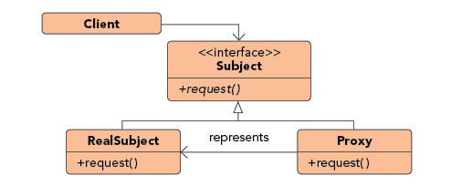

### 观察者模式（Observer Pattern）

##### 结构模式（Structural Pattern）

#### 定义

***Lets one or more objects be notified of state changes in other objects within the system.***

*** ***

### 优点
。

### 例子分析

##### 文件读取案例

### 参考文档：

https://en.wikipedia.org/wiki/Template_method_pattern

https://dzone.com/articles/design-patterns-template-method