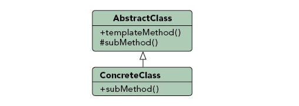

### 模板方法模式（Template Method Pattern）

##### 行为模式（Behavioural Pattern）

#### 定义

***Defines the skeleton of an algorithm in a method, deferring some steps to subclasses. Template Method lets subclasses redefine certain steps of an algorithm without changing the algorithms structure.***

***定义一个操作中的算法的骨架，而将一些步骤延迟到子类中，使得子类可以不改变一个算法的结构即可重定义该算法的某些特定步骤。***




### 优点
1. 封装和控制了业务的不变部分。
2. 实现代码复用，将公共功能部分代码抽取出来，更易于维护。

### 例子分析

##### 下载工具案例
有一个下载工具，可能有多个步骤，目前为了简化假设只有两个：首先是下载文件，然后是写入磁盘。

下载文件会有多种方式，比如http直接下载，也可能是ftp下载（需要用户名和密码），写入磁盘也可能有不同的实现。

1. 我们在父类中定义了下面的方法模版：
```go
func (t *Template) Download(url string, savePath string) {
	fmt.Println("start download")
	t.Implement.download(url)
	t.Implement.save(savePath)
	fmt.Println("finish download")
}
```

2. 在具体实现方法中，ftp下载器的实现：
```go
type FtpDownloader struct {
	UserName string
	PassWord string
}

func (*FtpDownloader) download(url string) {
	fmt.Println("ftp download from ", url)
}

func (*FtpDownloader) save(savePath string) {
	fmt.Println("ftp save file to ", savePath)
}
```

3. 在具体实现方法中，http下载器的实现：
```go
type FtpDownloader struct {
	UserName string
	PassWord string
}

func (*FtpDownloader) download(url string) {
	fmt.Println("ftp download from ", url)
}

func (*FtpDownloader) save(savePath string) {
	fmt.Println("ftp save file to ", savePath)
}
```

4. 执行测试代码，分别用不同的下载器进行下载：
```go
func main() {
	template := Template{}

	ftpDownloader := FtpDownloader{
		UserName: "testUser",
		PassWord: "password",
	}
	template.Implement = &ftpDownloader
	template.Download("ftp://www.xxx.com/a.zip", "/opt/local")

	httpDownloader := HttpDownloader{}
	template.Implement = &httpDownloader
	template.Download("http://www.xxx.com/a.zip", "/opt/local")
}
```

5. 输出结果
```go
start download
ftp download from  ftp://www.xxx.com/a.zip
ftp save file to  /opt/local
finish download
start download
http download from  http://www.xxx.com/a.zip
http save file to  /opt/local
finish download
```

### 参考文档：

https://en.wikipedia.org/wiki/Template_method_pattern

https://dzone.com/articles/design-patterns-template-method